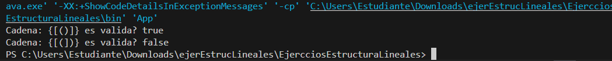
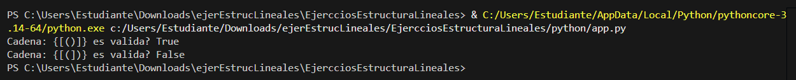

# ADD: Ejercicio 01 - Sing Validator en Java y Python (HECHO EN CLASES).

## Validacion de Apertura y Cierres (Stack Java):
1. Ingresamos la letra como Caracteres a la pila
2. vAlidamos si es una apertura 
3. Revisamos si son del mismo tipo de uan que ya esta, si es asi y cierra la sacamos
4. si al final queda vacia significa ques es valida

## Validacion de Apertura y Cierres (Stack Python):
Adaptamos el codigo anterior, al elnguaje de Python

# ADD: Ejercicio 02 && Ejercicio 03 - Stack Sorter y Queue Palindrome en Java.

## Validacion Palindromo (Stack Java):
1. Volvemos el texto en una sola palabra en misnuscula y pegado antes de agregarla

2. sacamos la palabra y vamos comparan do

3. si hay un moemnto que son diferentes **NO** es un palindromo

## Validacion Palindromo (Cola Java):
1. Primera parte igual al anterior
2. comapramos el primero con el ultimo de la cola
3. si hay un momento que no son iguales significa que **NO** es un palindromo 

